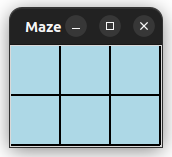
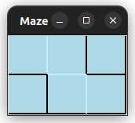
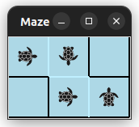
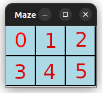

# Maze Project

This project is a Python application that creates and updates a labyrinth based on the information in a JSON file. The
labyrinth is represented as a grid of tiles, and each tile can have walls on its borders. The labyrinth is drawn using
the Tkinter library.

## Dependencies

- Python 3.6 or higher
- Tkinter

## Files

- `labyrinth.py`: Contains the `Labyrinth` class which is used to create and solve the labyrinth.
- `tiles.py`: Contains the `Tile` class which is used to represent each tile in the labyrinth.
- `graph_example.py`: Contains an example graph and a solution for the graph.

## How to Use

### Labyrinth Class

The `Labyrinth` class is used to create and update the labyrinth GUI. Here's how to use it:

1. Initialize a new instance of the `Labyrinth` class. The constructor takes two arguments: the number of rows and the
   number of columns in the labyrinth.

```python
maze = Labyrinth(2, 3)
```

2. Generate the board for the labyrinth by calling the `get_board` method. This method creates a list of `Tile` objects,
   one for each cell in the labyrinth, and draws each tile on the canvas.

```python
maze.get_board()
```

<p align="center">
  
</p>

3. Update the labyrinth based on the information in a JSON file by calling the `update_maze` method. This method reads a
   JSON file located at '/dev/shm/graph.json', loads the JSON data into a dictionary, and checks the walls in the maze
   based on this data. If the file does not exist, it prints a message indicating this. After checking the walls, the
   method schedules itself to be called again after 300 milliseconds. This allows the maze to be updated in real time as
   the JSON file changes.

```python
maze.window.after(1000, maze.update_maze)
```
<p align="center">
  
</p>

4. Solve the labyrinth based on the information in a JSON file located at '/dev/shm/sol_graph.json'. This file should
   contain a dictionary where each key-value pair represents a step in the solution path.

```python
maze.window.after(5000, maze.solve_maze)
```

<p align="center">
  
</p>

5. Start the Tkinter event loop by calling the `mainloop` method on the `window` attribute. This method will keep the
   window open until it is closed by the user.

```python
maze.window.mainloop()
```

## Example Graphs

The `graph_example.py` file contains an example graph and a solution for the graph. The graph is represented as a
dictionary where each key-value pair represents a wall in the labyrinth. The solution is represented as a dictionary
where each key-value pair represents a step in the solution path.

To use the example graph and solution, run the `graph_example.py` file before running the `labyrinth.py` file.
The `graph_example.py` file will create two JSON files in '/dev/shm': 'graph.json' and 'sol_graph.json'. These files
will be used by the `Labyrinth` class to update and solve the labyrinth.

## JSON Files

### Graph Structure JSON File

The JSON file should be located at '/dev/shm/graph.json' and should have the following structure:

```json
{
  "V": {
    "0": [
      "1",
      "3"
    ],
    "1": [
      "0",
      "2"
    ],
    "2": [
      "1"
    ],
    "3": [
      "0"
    ]
  },
  "E": {
    "(0, 1)": 0,
    "(0, 3)": 1,
    "(1, 0)": 0,
    "(1, 2)": 1,
    "(2, 1)": 1,
    "(3, 0)": 1
  }
}
```

In this JSON file, `"V"` is a dictionary that represents the vertices in the labyrinth. Each key is a vertex, and the
value is a list of vertices that are connected to the key vertex.

`"E"` is a dictionary that represents the edges in the labyrinth. Each key is a string representation of a tuple that
contains two vertices, and the value is an integer that represents the state of the wall between the two vertices. If
the value is `0`, there is a wall between the vertices. If the value is `1`, there is no wall between the vertices.

Every vertex in the labyrinth represents the label of the tile in the labyrinth. The vertices are numbered from 0 to n-1
where n is the number of vertices in the labyrinth.

<p align="center">
  
</p>

### Solution Path JSON File

The JSON file should be located at '/dev/shm/sol_graph.json' and should have the following structure:

```json
{
  "0": "1",
  "1": "4",
  "4": "5",
  "5": "f"
}
```

The solution path JSON file should contain a dictionary where each key-value pair represents a directed edge in the
path.
The key is the starting vertex of the edge, and the value is the ending vertex of the edge. The last vertex in the path
should
have a value of "f" to indicate the end of the path.

## Running the Application

To run the application, navigate to the project directory and run the `labyrinth.py` file:

```bash
python labyrinth.py
```

This will open a new window that displays the labyrinth. The labyrinth will be updated in real time as the JSON file
changes.

To run the example graph and solution, run the `graph_example.py` file in a different terminal window:
```bash 
python graph_example.py
```

Both the `labyrinth.py` and `graph_example.py` files should be running at the same time to see the labyrinth update and 
solve in real time.

## License
This project is licensed under the MIT License - see the [LICENSE](LICENSE) file for details.


